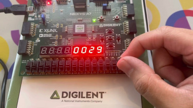

# Seven-Segment-LED-Display-On-FPGA

Created a C++ project which takes 8 signals as input from a Digilent Nexys A7-100T board/device and displays the correct number on it.

This implementation supports input from [0, 99] (only 1 or 2 digits numbers can be displayed).

Implemented the Double Dabble algorithm for simplifying the conversion between Binary and BCD formats.

Operated with High-level synthesis feature from Vitis HLS so that the C++ behavioral specification is used in Vivado along with a constraint file (Nexys-A7-100T-Master.xdc).

Credits to [Andrei Buhnici](https://github.com/AndreiBuhnici) for giving me some advices and inspiration.

